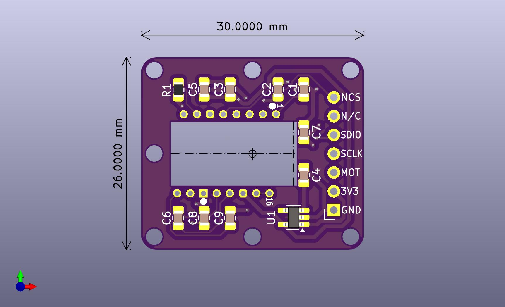

# PMW3610 Breakout Board - SUSUGOROMO-3610（煤衣-3610）

## 寸法図/Dimensions

## 回路図/Schematic
* [PDF](img/schematic.pdf)

## ピン番号
|1  |2   |3   |4   |5     |6  |7  |
|---|----|----|----|------|---|---|
|NCS|N/C |SDIO|SCLK|MOTION|3V3|GND|

## 部品表/BOM

| Reference      | Value               | Footprint | Qty |
| -------------- | ------------------- | --------- | --- |
| C3, C4, C6, C7 | 0.1uF X7R           | 0805      | 4   |
| C5             | 1uF                 | 0805      | 1   |
| C1, C8         | 0.01uF X7R          | 0805      | 2   |
| C9             | 10uF X7R            | 0805      | 1   |
| C2             | 3.3uF/16V           | 0805      | 1   |
| R1             | 10k                 | 0805      | 1   |
| U1             | TLV70019DDCR        | SOT23-5   | 1   |
| U2             | PMW3610DM-SUDU      |           | 1   |

## Dependencies (KiCad)
* [is-watering/isw-kbd-lib](https://github.com/is-watering/isw-kbd-lib)

## ライセンス/License
This project is licensed under the CERN OHL-P v2.
You may use, distribute, and modify this design under the terms of the CERN OHL-P v2.
Original design by snize.

### 本プロジェクトを利用する場合について
- 著作権表示とライセンスの表示を残してください
